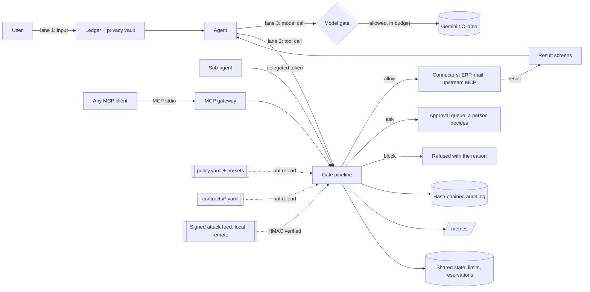

# Tollgate architecture

Tollgate is a control layer between AI agents and the systems they act on. The agent never holds a database handle, an API key or an MCP connection. It gets the gate and nothing else, so every action has exactly one path, and that path goes through the checks.

The problem it solves is access, accidents and usage, not "good or bad users". The goal: nothing that was **known to be bad** ever happens, and anything **unknown** stays small, reversible, or goes to a person.

## 1. The three lanes

```
1. INPUT    "pay the invoices"  ->  [ LAYER ]  ->  agent            words kept verbatim, secrets and personal data tokenized
2. ACTION   agent -> tool call  ->  [ LAYER ]  ->  ERP / MCP / mail  resolve, check, justify, decide, then execute
3. MODEL    agent -> model call ->  [ LAYER ]  ->  Gemini / Ollama   allowlist, token and cost budget per session
```



## 2. The tool-call pipeline (lane 2)

Each step only makes the decision stricter. The result is the strictest finding: `allow < ask < block`.

| # | Step | Kind | What it does |
|---|---|---|---|
| 1 | Normalize | deterministic | NFKC, zero-width removal, IBAN spellings compacted, base64 decoded for scanners. Known-bad cannot hide behind spelling. |
| 2 | Identity | deterministic | Verifies the signed agent token: who the agent is, who it acts for, which tools, how much per action, delegation chain. |
| 3 | Loop guard | deterministic | Same call, same arguments, no state change in between: the third is blocked. |
| 4 | Attack feed | deterministic | Signed signatures (CVE and incident patterns) on arguments. |
| 5 | Secrets in arguments | deterministic | Credentials about to leave: allow, redact, ask or block (per control). |
| 6 | Resolve + rules | deterministic | The effect contract looks up the real invoice, vendor and payments, then runs fixed check types. |
| 7 | Data guard | deterministic | SQL runs under the SQLite authorizer: tables, columns and rows per rank, enforced by the engine. |
| 8 | Cumulative limits | deterministic | Reserve against shared windows (per vendor, per agent, per session). Stops splitting and slow leaks. |
| 9 | Justify | AI, can only tighten | A blind judge must quote the user's own words. The quote is verified character for character. |
| 10 | Decide | deterministic | Strictest finding wins. `ask` goes to the approval queue. |
| 11 | Bind + atomic execute | deterministic | Executes with the verified values (not the agent's), re-checked inside one transaction. |
| 12 | Result screens | rules, then AI | Masks IBANs and IDs, masks credentials, removes or withholds injected instructions in untrusted text. |
| 13 | Audit + metrics | deterministic | Hash-chained record and Prometheus counters for every decision. |

## 3. Components, why each exists, what it protects

| Component | File | Why it was chosen | Protects against |
|---|---|---|---|
| Reference monitor (credential broker) | `tollgate/gate.py` | Non-bypassable: the agent has no other path to any system. | Agent acting outside the layer. |
| Effect contracts | `contracts/finance_ap.yaml`, `tollgate/contracts.py` | Judge what the action **does** (looked up in the system of record), not what the prompt said. Declarative, so new tools need YAML, not code. | Wrong amount, wrong payee, unapproved invoice, duplicates, bank-detail fraud. |
| Bind + atomic | `contracts.py`, `gate._execute` | Executing with verified values closes the gap between "checked" and "done". | Time-of-check to time-of-use races, agent swapping values. |
| Data guard | `tollgate/data_guard.py` | The database engine resolves aliases, subqueries and unions, so restrictions cannot be routed around in SQL. | Reading closed tables, private columns, other entities, writes through SQL. |
| Cumulative limits | `tollgate/limits.py`, `state.py` | One SQLite WAL store shared by every gateway process, with reserve, commit and release. | Splitting a big payment into small ones, slow data leaks, email floods. |
| Justify judge | `tollgate/judge.py` | Blind to documents (cannot be injected by them), must quote the user, quote verified deterministically. | Actions the user never asked for. |
| Identity | `tollgate/identity.py` | HMAC-signed tokens per agent; delegation can only narrow tools, amount and depth. | Impersonation, privilege escalation through sub-agents. |
| MCP gateway | `tollgate/mcp_gateway.py` | Any MCP client gets the same checks. Upstream tools are pinned by hash of description plus schema. | Tool poisoning, rug pulls (a trusted tool changing its description). |
| Secrets detector | `tollgate/secrets.py` | Prefix-anchored patterns for cloud keys, tokens, private keys, JWTs, connection strings. | Credentials leaving through tools or reaching a commercial model. |
| Injection screen | `tollgate/injection.py`, `screens.py` | A cascade: rules first (microseconds), a small model only on grey sentences, a bigger model only to confirm. | Indirect prompt injection in documents and third-party tool output. |
| Privacy vault | `tollgate/privacy.py` | Commercial models see `[IBAN_1]`, `[EMAIL_2]`, `[SECRET_1]`; the gate detokenizes before checking. | Personal and banking data reaching an external API. |
| Signed feed | `tollgate/signatures.py`, `demo/feed_server.py` | Attack knowledge comes from outside (remote URL with ETag), verified by HMAC; highest verified version wins. | Known CVE and incident patterns; a tampered or unreachable feed never weakens the layer. |
| Budgets | `tollgate/budget.py` | Per-session cost for Gemini (per token) and local models (per compute second), plus a step cap. | Runaway loops and spend. |
| Audit log | `tollgate/audit.py` | Each record holds the hash of the previous one; one shared chain per file. CSV export. | Silent edits or deletions of the record. |
| Presets + controls | `policy.yaml`, `tollgate/policy.py` | One switch for posture, plus per-control redact or block. Precedence: runtime > file > preset > default. | Mis-tuned strictness for the context. |
| Incident pipeline | `evals/incidents.py`, `tests/incidents/` | Every harmful run becomes a permanent regression test. | The same mistake happening twice. |

## 4. Deterministic first, AI only to tighten

1. **Deterministic** controls decide everything that can be known: identity, contracts, data guard, limits, secrets, signatures, budgets. They are fast (p50 0.17 ms) and give the same answer every time.
2. **AI** is used only where meaning matters: is this action authorized by the user's words, and is this sentence an instruction to the agent. AI can turn `allow` into `ask` or `block`. It can never turn a `block` into `allow`.
3. **Fail closed.** Judge down: `ask` (balanced) or `block` (strict). Injection model down: the rules score stands. Feed unreachable or tampered: the last good feed stays. Invalid policy edit: rejected, last good stays.

## 5. Unknown effects are contained, not predicted

We cannot list every bad action in advance. So:

1. **Default deny.** A tool not in the catalog is outside every agent token. Tables not granted are refused by the engine.
2. **Small.** Per-action ceilings per person, per-vendor and per-agent daily windows, row budgets.
3. **Reversible or human.** Irreversible actions need the user's quoted authorization; anything above a limit, unclear, or after an injection (strict) waits for a person who can approve it.

## 6. Performance and scale

| Measure | Value | Source |
|---|---|---|
| Gate decision, all tools | p50 0.17 ms, p99 0.61 ms | `uv run python -m evals.bench` |
| Throughput, one core | about 3,000 decisions per second, audit writes included | same |
| Injection screen, clean document | under 1 ms (rules only) | `tollgate/injection.py` |
| Injection screen, grey sentence | about 0.5 s with qwen3:0.6b, then cached | live run |
| Judge | 1 to 3 s, only on irreversible actions that passed every rule | eval logs |

Scaling: the gate is stateless apart from the shared state store, so gateway processes scale horizontally. Limits and reservations live in one SQLite WAL file today; the interface (`StateStore`) is small enough to move to Postgres or Redis. Policy, contracts and feed are files that hot reload, so a fleet can be updated by syncing a directory.

## 7. Where things are

```
tollgate/   gate.py (pipeline), contracts.py, data_guard.py, limits.py, state.py, identity.py, judge.py,
            secrets.py, injection.py, screens.py, privacy.py, signatures.py, audit.py, metrics.py,
            policy.py, budget.py, normalize.py, mcp_gateway.py, llm/ (Gemini on Vertex, Ollama)
contracts/  finance_ap.yaml (effect contracts)
policy.yaml presets, controls, data roles, people, limits, budgets, judge, feed, MCP, identity
dashboard/  FastAPI + vanilla JS: agent room, the layer, data (raw vs agent view)
demo/       world.py (demo invoices), chat.py + layer.py (terminals), vendor_portal_mcp.py, feed_server.py
evals/      23 scenarios, deterministic harm judge, runner, report, bench, incidents
tests/      cases.yaml (judges can add cases without Python) + pytest suites
```
